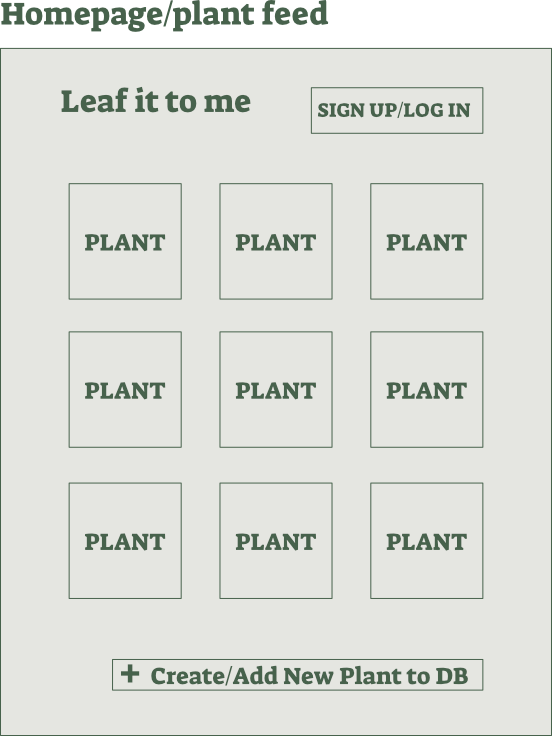
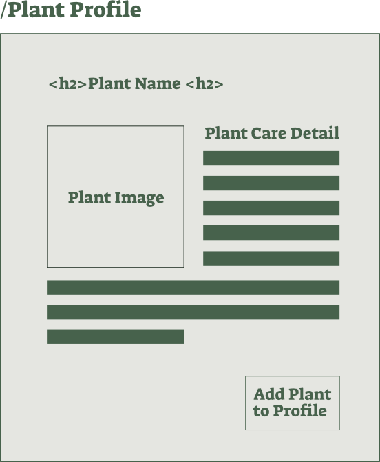
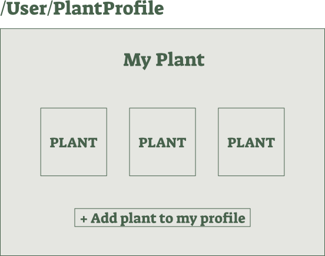
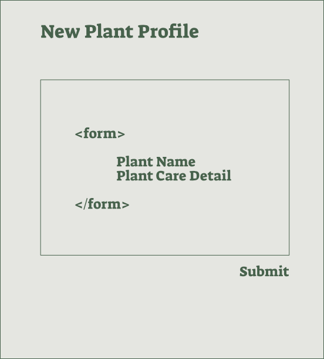
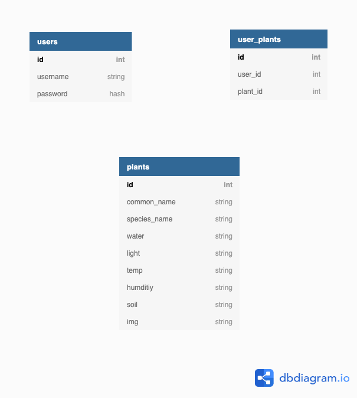

# Leaf it to me


# MERGE TIME!! Git Protocol in a Team!
* Feature is done, ready to create a pull request to Development?? 

### 5. Commit your branch
```
git add .  
git commit -m “readyToMerge”   
```

### 6. Pull Development into your branch, open VScode & deal with the conflicts there.

```
git pull origin Development
code .
```
### 7. Vscode

* Files marked C = Conflict
* Files marked M = Modified
* <<<<< Head  = This is you! Current changes, you are HEAD
* <<<<<< Incoming change = pulled in from the Development branch

### 8. Any conflicts or changes need to be saved, added, & committed again

```
git add .
git commit -m “mergeTime”
git push origin myBranch
```
### 9. Github - create pull request

* Create pull request from mybranch to Development (on github)
* Tell the git keeper, they will merge the pull request and there should be 0 conflicts as you have already resolved these in your branch.

### Create a new branch with a new name
```
git checkout -b feature/myNextFeature  
code .  
```
### 10. GitKeeper - merge the request

* Merge the pull request on Github only if there are 0 conflicts, then delete the branch.

### 11. Everyone else now needs to pull from Development & update their modules
```
git pull origin Development
npm i
```
* Reset database
```
rm server/db/dev.sqlite3
npm run knex migrate:latest
npm run knex seed:run

```

### Update 

run this in the terminal for auth:

```
 cp .env.example .env
```
once your database has first been populated, you can now use this shortcut
to delete the sql file, run migrations and run seed sequentially
```
npm run db-reset
```
## magical git witch shortcut to push your branch --> your branch

```
make pushbranch m='commitMessage'
```

## WIREFRAMES & components
### Components showing on all pages - Header.jsx, Nav.jsx

## Page 1
### Components - Home.jsx, PlantList.jsx, Plant.jsx
### wireframe:


## Page 2 
### Components - IndividualPlant.jsx
### wireframe:


## Page 3
### Components - Login\Register\User\.jsx
### wireframe:


## Page 4
### Components - SavedPlants.jsx, PlantList.jsx Plant.jsx
### wireframe:
 


## page 5 
### Components - AddPlantForm.jsx
###   wireframe:




# USER STORIES

### Unauthorised Users:

- [x] As an unregistered user I would like to be able to see a list of all of the plants on the homepage
- [x] As an unregistered user I would like to be able to search for a specific plant on the homepage
- [x] As an unregistered user I would like to click on a plant from the homepage & be re-directed to see it’s individual profile page
- [X] As an unregistered user I would like to be able to click on a button on the plant to add a new plant and then be re-directed to the signup page which will tell me I need to register before I can add new plants to the main plant list and/or my own profile
- [x] As an unauthorised user I would like to be able to register
- [x] As an unauthorised user I would like to be able to log in

### Authorised Users: 

- [x] As a signed in user I would like to be able to see a list of all of the plants on the homepage & then click on a plant to be re-directed to it’s individual profile page where I would be able to click to add the plant to my profile
- [x] Once I’ve signed into my account (via clicking the login link on homepage) I’d like to be able to see a list of all of my saved plants 

- [x] As a signed in user if I select to add my own plant I’d like to be able to fill out a form with my plant’s name & care details and also add an image.
- [ ] Once submitted my custom plant would automatically be added to my profile.
- [ ] _optional / stretch?_ As a signed in user I would like to be able to see a list of all the plants on the homepage and tick which plants I’d like to add to my profile 
- [x] I would like to be able to log out

# STRETCH USER STORIES
### Authorized Users:
- [ ] As a user I'd like to see my name or usersname on my profile to indicate that it's my profile.
- [ ] As a user I'd like to be able to delete a selected plant of my choice that was added into my profile.
- [ ] Once signed in I’d also like to see a ‘add your own plant’ button which once clicked would ask me if I would like to add a new plant to my profile from the existing database (in which case I’d be directed back to the homepage) OR whether I’d like to add my own custom plant 

# API

| Method | Path | Description | NOTES |
|---|---|---|---|
| POST | /api/v1/register | Adds a user - registering them | Authenticare
| POST | /api/v1/login | Logs a user in and gets a users info from the DB | Authenticare
| GET | /api/v1/user | Gets the user information
| GET | /api/v1/plants | Gets all plants from the DB
| POST | /api/v1/plants| Adds a newly created plant to the plants DB
| ~~GET~~ | ~~/api/v1/plant/:name~~ | ~~shows individual plant with all details~~ | No additional db call necessary if we have all data in our global state 
| GET | /api/v1/plants/saved | Gets the logged in persons plants from the users_plants DB
| POST | /api/v1/plants/saved | Adds a plant to the users_plants DB (from the plants list or a newly created one)
| POST | /api/v1/image-upload | Adds an updoaded plant image as an AWS http string to the plants DB
|---|---|---|---|

# API Request and response bodies

### /api/v1/plants

##### _Response_

```js 
     plants: [{
    0: {
      id: int,
      common_name: string,
      species_name: string,
      img: url
      },
  }],
```

### /api/v1/plant/:name 
<span style="color:red">*Might not even be necessary if we get all the plants and details into the global space with the /api/v1/plants call. Should ask Ross/Kelly for best practice.*</span>

##### _Response_

```js
{
      id: int,
      common_name: string,
      species_name: string,
      water: string,
      light: string,
      temp: string,
      humidity: string,
      soil: string,
      img: url
      }
```

### /api/v1/plants/saved

##### _Request_

```js
{
 user_plants: {
      id: int,
      user_id: int,
      plant_id: int,
      name: string,
      notes: string,
      img: url
  }
}
```

##### _Response_
<!-- TODO: What will the response be? -->

### /api/v1/user

##### _Response_

```js
{
  id
  username
}
```

### /api/v1/plants/saved

##### _Response_

```js
 user_plants: [{ 
    0: {
      id: int,
      user_id: int,
      plant_id: int,
      name: string,
      notes: string,
      img: url
      },
  }]
```

# Global State

The global state object looks a bit like this:


```js

const globalState = {
  search: {
    //search functionality for specific plant?
  },
  plants: [{
    0: {
      id: int,
      common_name: string,
      species_name: string,
      water: string,
      light: string,
      temp: string,
      humidity: string,
      soil: string,
      img: url
      },
  }],
  auth: {
    loggedIn: bool,
    user: {
      id: int,
      username: string,
    }
  },
  user_plants: {
      id: int,
      user_id: int,
      plant_id: int,
      name: string,
      notes: string,
      img: url
  }
}
```

# Database Diagram



* Clone & Make a branch Steps 1 - 4
* Merge your feature Steps 5 - 11

### 1. Clone
```
cd workspace
git clone + https link
cd myRepo
```
### 2. Make a branch using the name of your feature
```
git checkout -b feature/aFeature  
code .  
```
### 3. Instal modules & reset the database
```
npm i
npm run knex migrate:latest
npm run knex seed:run
```
## 4. Commit & Push your branch
```
git status 
git add .  
git commit -m “commit message”  
git push origin myBranch  
```
# Accessibility
pulling out all of the Web Content Accessibility Guidelines (WCAG) that apply to our site currently

##principle 1 - PERCEIVABLE
Text alt:
-provide text alternatives for any non-text content so that it can be changed into other forms people need, such as large print, braille, speech, symbols or simpler language
-Controls, Input: If non-text content is a control or accepts user input, then it has a name that describes its purpose.
Decoration, Formatting, Invisible: If non-text content is pure decoration, is used only for visual formatting, or is not presented to users, then it is implemented in a way that it can be ignored by assistive technology
Adaptable:
